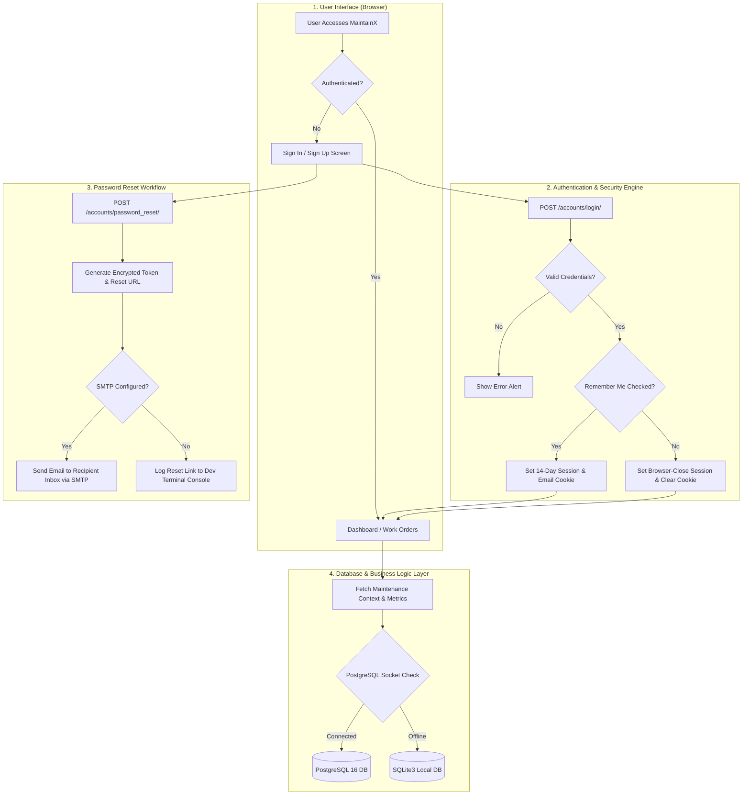

# MaintainX — Maintenance & Equipment Management Platform

MaintainX is a modern, enterprise-grade Equipment and Maintenance Work Order Management System built with **Django**, **PostgreSQL** (with dynamic **SQLite3** fallback), and a responsive **Dark/Light Mode** user interface.

---

## 🚀 Key Features

- **🔐 Robust Authentication & Security**:
  - Custom User Model supporting **Technician** and **Customer** roles.
  - Password Reset workflow with console logging in development & real **SMTP** email delivery support.
  - **Remember Me** session persistence (14-day token) with optional **Email Auto-Fill**.
  - Custom password visibility toggle (**Eye button**) with browser reveal icon suppression.
  - Security redirects for authenticated users visiting login/signup pages.

- **📊 Real-Time Dashboard & Analytics**:
  - Key Performance Indicators (Total Requests, In-Progress, Resolved, Active Workers, Urgent Requests).
  - Dynamic statistics calculated directly from the database layer.

- **🛠 Work Order & Equipment Tracking**:
  - Request creation, status pipeline (Open, In Progress, Resolved), worker assignment, and priority badges.
  - Equipment details, status monitoring, and technician history logs.

- **🗄 Flexible Dual-Database Architecture**:
  - Automatic connection check: connects to **PostgreSQL 16** if available, or seamlessly falls back to **SQLite3**.
  - Docker Compose service configuration included for one-command PostgreSQL deployment.

- **🎨 Modern Responsive UI System**:
  - Custom component system with CSS variables, floating labels, FontAwesome 6 icons, and dark mode theme toggling.

---

## 🔄 System Execution Flow



### Detailed Execution Steps:
1. **User Onboarding / Sign In**:
   - The user visits the application. If already authenticated, they are automatically redirected to `/dashboard/`.
   - On the Sign In page, if `remembered_email` cookie exists, the email field is pre-filled and "Remember me" is checked.
   - Password fields feature an interactive eye icon button to toggle visibility.

2. **Session & Cookie Management**:
   - When **Remember me** is checked, Django assigns a 14-day persistent `sessionid` and sets a 30-day `remembered_email` cookie.
   - Logging out triggers `logout_view`, which terminates the session and displays a single notification banner (*"You have been logged out successfully"*).

3. **Maintenance Pipeline**:
   - Authenticated users access the Dashboard, Tickets, Create Ticket, Workers, Analytics, and Settings pages.
   - Database queries aggregate live request statistics, worker statuses, and urgent ticket queues.

4. **Database Socket Detection**:
   - On startup/request, Django performs a non-blocking TCP socket check to `DB_HOST:DB_PORT` (default `localhost:5432`). If PostgreSQL is active, Django routes queries to PostgreSQL 16; otherwise, it falls back gracefully to `db.sqlite3`.

---

## 🛠 Project Structure

```text
MaintainX/
├── accounts/                  # Authentication & User Management App
│   ├── models.py              # Custom User Model (AbstractUser)
│   ├── views.py               # Signup, Login, Logout views & Remember Me logic
│   ├── urls.py                # Auth & Password Reset URL routes
│   └── tests.py               # Automated Unit Tests for Auth
├── equipment/                 # Equipment & Asset Management App
│   └── tests.py               # Automated Unit Tests for Equipment
├── maintenance/               # Maintenance Work Orders & Analytics App
│   ├── views.py               # Dashboard, Tickets, Analytics & Settings views
│   ├── urls.py                # Dashboard & UI routes
│   └── tests.py               # Automated Unit Tests for Maintenance
├── maintainx/                 # Django Core Project Settings & Config
│   ├── settings.py            # Main Settings (Database fallback, Email, Sessions)
│   ├── urls.py                # Root URL Routing
│   └── wsgi.py                # WSGI Deployment Entrypoint
├── static/                    # Static Assets (CSS & JavaScript)
│   ├── css/                   # Variables, Base, Components, Layout stylesheets
│   └── js/                    # Main JavaScript (Theme toggle, Eye toggle, Modals)
├── templates/                 # HTML Templates
│   ├── accounts/              # Login, Signup, Password Reset templates
│   ├── dashboard.html         # Main Maintenance Dashboard
│   ├── tickets.html           # Work Order Tickets List
│   ├── create-ticket.html     # Ticket Creation Form
│   ├── workers.html           # Active Workers Overview
│   ├── analytics.html         # Maintenance Analytics & Charts
│   └── settings.html          # Account & System Settings
├── .env.example               # Environment Variables Template
├── docker-compose.yml         # PostgreSQL 16 Container Configuration
├── manage.py                  # Django Management Script
└── requirements.txt           # Python Dependencies
```

---

## 📋 Prerequisites & Installation

### Prerequisites
- **Python 3.10+**
- **pip** and **virtualenv**
- *(Optional)* **Docker Desktop** (for running PostgreSQL 16 container)

### Step 1: Clone or Navigate to Project Directory
```bash
cd MaintainX
```

### Step 2: Set Up Environment Variables
Create a `.env` file in the project root directory (or copy from `.env.example`):

```env
# Django Secret Key & Debug
SECRET_KEY=django-insecure-your-secret-key-here
DEBUG=True

# Database Configuration (PostgreSQL)
USE_POSTGRES=True
DB_NAME=maintainx_db
DB_USER=postgres
DB_PASSWORD=postgres
DB_HOST=localhost
DB_PORT=5432

# Real Email Delivery via SMTP (Optional)
# EMAIL_HOST=smtp.gmail.com
# EMAIL_PORT=587
# EMAIL_USE_TLS=True
# EMAIL_HOST_USER=your_email@gmail.com
# EMAIL_HOST_PASSWORD=your_app_password
# DEFAULT_FROM_EMAIL=your_email@gmail.com
```

---

## 🚀 Running the Application

### Step 1: Start PostgreSQL Database (Optional)
If using Docker for PostgreSQL:
```bash
docker compose up -d
```
*(Note: If Docker/PostgreSQL is not running, MaintainX will automatically connect to local `db.sqlite3`).*

### Step 2: Apply Database Migrations
```bash
python manage.py migrate
```

### Step 3: Run Automated Test Suite
Verify that all unit tests pass:
```bash
python manage.py test
```

### Step 4: Start the Development Server
```bash
python manage.py runserver
```

Open your browser and navigate to:  
👉 **`http://127.0.0.1:8000/`**

---

## 🧪 Testing Credentials (Quick Start)

You can create a superuser account for admin testing:
```bash
python manage.py createsuperuser
```

Or test signup directly via the web interface at **`http://127.0.0.1:8000/accounts/signup/`**.

---

## 📜 License
This project is licensed under the MIT License.
