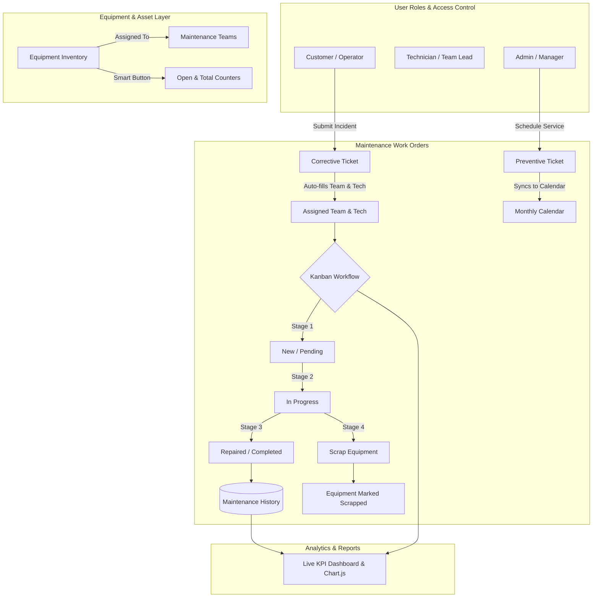

# GearGuard — Equipment & Maintenance Operations Platform

[](https://www.djangoproject.com/)
[](https://python.org)
[](https://www.postgresql.org/)
[-success?style=flat-square)](#-automated-testing--quality-assurance)

**GearGuard** (evolved and upgraded from MaintainX) is an enterprise-grade Computerized Maintenance Management System (CMMS) designed for manufacturing plants, industrial facilities, and engineering workshops. It provides end-to-end asset lifecycle tracking, automated team dispatching, interactive Kanban workflows, preventive calendar scheduling, equipment smart metrics, and real-time operational analytics.

---

## 🚀 Key Feature Inventory (Phases 1–9)

### 🔐 1. Authentication, Roles & Security (Phases 1 & 8)
- **Custom User Model**: Distinct roles — `admin`, `manager`, `technician`, and `customer`.
- **Role-Based Access Control (RBAC)**: Enforced via model permissions and view guards (HTTP 403 on unauthorized mutations).
  - *Admin / Manager*: Full access to manage equipment, dispatch teams, adjust configurations, and delete records.
  - *Technician / Team Leader*: Can view assigned tickets, update work statuses, record durations, log completion history, and schedule preventive maintenance.
  - *Customer / Operator*: Can view dashboard, submit corrective maintenance tickets for active equipment, and track ticket status.
- **Session Persistence**: "Remember Me" 14-day tokenized sessions, automatic email pre-fill, and browser-close session expiration when unchecked.
- **Password Reset Engine**: Multi-step tokenized password reset supporting console output in development and secure SMTP email delivery in production.
- **Credential Protection**: Interactive password visibility toggle (eye button) with vendor reveal suppression.

### 🏭 2. Equipment & Asset Management (Phase 2 & 7)
- **Equipment Inventory**: Detailed asset profiles including Serial Numbers (unique), Categories, Departments, Warranty Expiration, Purchase Dates, and Operational Statuses (`active`, `inactive`, `maintenance`, `retired`, `scrapped`).
- **Team & Specialist Assignment**: Associate equipment directly with designated Maintenance Teams and Default Technicians for instant triage.
- **Equipment Smart Features (Phase 7)**:
  - **Maintenance Smart Button**: Displays live counts of open and total maintenance requests on each equipment profile.
  - **Dedicated Equipment Maintenance View**: Drill-down view showing active requests, historical logs, and latest status.
  - **Direct Ticket Creation**: Pre-fills equipment ID when opening ticket creation from equipment view.

### 🛠 3. Maintenance Requests & Business Logic (Phases 3 & 4)
- **Request Types**: Corrective (breakdown/incident repair) and Preventive (planned service/inspections).
- **Automated Dispatching Engine**: Automatically assigns the equipment's designated Maintenance Team and Default Technician if left blank.
- **Team-Technician Consistency**: Validates that assigned technicians belong to the assigned maintenance team.
- **Terminal State Protection**: Enforces workflow transitions; prevents transitioning out of terminal states (`completed`, `repaired`, `scrap`, `cancelled`).
- **Equipment Scrap Lifecycle**: Marking a request as `scrap` automatically decommissions the associated equipment (`status = 'scrapped'`) and blocks all subsequent ticket creation on it.
- **Dynamic Duration Units**: Supports granular work logs in `minutes`, `hours`, or `days` with automatic conversion to normalized decimal hours (e.g., 90 minutes = 1.50 hours).

### 📋 4. Interactive Kanban Board (Phase 5)
- **Visual Drag-and-Drop Workflow**: Four-stage Kanban pipeline: `New / Pending` ➔ `In Progress` ➔ `Repaired / Completed` ➔ `Scrap`.
- **Quick Status Selector**: Direct dropdown trigger on each card for non-drag environments.
- **Overdue Badges**: Dynamic indicators that flag tickets exceeding scheduled maintenance deadlines.

### 📅 5. Preventive Maintenance Calendar (Phase 6)
- **Interactive Monthly Calendar**: Visual layout of scheduled preventive maintenance events.
- **Slot Scheduling Modal**: Click any date to launch the accessible scheduling modal.
- **Reschedule via API**: Seamlessly update scheduled service dates via drag-and-drop or modal adjustments.
- **UI Architecture**: Modal built with flex-column layout, sticky header and footer, cancel semantics (`type="button"` and `data-modal-close`), and backdrop dismissal.

### 📈 6. Advanced Analytics & Reporting (Phase 8)
- **Live Interactive Dashboards**: Powered by Chart.js consuming JSON APIs (`/analytics/?format=json`).
- **Operational KPIs**: Total Requests, Completed Count, Active Equipment, Scrapped Equipment, Open Incidents.
- **Multi-Dimensional Metrics**:
  - Breakdown by Maintenance Team (workload distribution).
  - Breakdown by Equipment Category.
  - Breakdown by Request Type (Corrective vs. Preventive).
  - Breakdown by Status & Priority.
  - Monthly Maintenance Trends.

### ⚡ 7. Performance & Code Polish (Phase 9)
- **N+1 Query Elimination**: Optimized ORM querysets across `dashboard`, `tickets_view`, and `equipment_list` using `.select_related()` and `.prefetch_related()`.
- **UI/UX Consistency**: Unified **GearGuard** branding, FontAwesome icons (`fa-shield-halved`), high-contrast accessible labels, and responsive layout across desktop and mobile.
- **Automated End-to-End Suite**: 29-step programmatic integration test verifying the complete realistic system lifecycle.

---

## 🔄 System Architecture & Workflow



---

## 🗄 Flexible Dual-Database Engine

GearGuard features an adaptive database connection manager:
- **Primary**: **PostgreSQL 16** for high-concurrency production deployments.
- **Automatic Fallback**: If PostgreSQL is offline or unreachable, GearGuard gracefully falls back to local **SQLite3** (`db.sqlite3`) with zero downtime or setup hurdles.

---

## 📁 Project Directory Structure

```text
MaintainX/
├── accounts/                  # User accounts, authentication & RBAC
│   ├── models.py              # Custom User model with roles & permission properties
│   ├── views.py               # Login, Signup, Logout, Remember Me logic
│   ├── urls.py                # Auth & Password reset routing
│   └── tests.py               # Authentication & Permission unit tests
├── equipment/                 # Equipment & Asset management
│   ├── models.py              # Equipment model with smart properties
│   ├── views.py               # Equipment CRUD & Equipment Maintenance view
│   ├── urls.py                # Equipment endpoints
│   └── tests.py               # Equipment unit tests
├── maintenance/               # Maintenance engine, Calendar & Analytics
│   ├── models.py              # Teams, Requests (clean/save validation), History
│   ├── views.py               # Dashboard, Tickets, Calendar, Analytics JSON APIs
│   ├── urls.py                # Maintenance routing
│   └── tests.py               # Unit tests & 29-Step E2E Integration Test Suite
├── maintainx/                 # Django project configuration
│   ├── settings.py            # Settings, DB socket fallback, Email config
│   ├── urls.py                # Root routing
│   └── wsgi.py                # WSGI entrypoint
├── static/                    # CSS stylesheets, JavaScript & asset icons
│   ├── css/                   # Design system (variables, base, components, layout)
│   └── js/                    # Client logic (Kanban, calendar, theme toggle)
├── templates/                 # Semantic HTML templates
│   ├── accounts/              # Auth & password reset pages
│   ├── dashboard.html         # Executive overview
│   ├── tickets.html           # Kanban & Ticket list
│   ├── calendar.html          # Preventive maintenance calendar
│   ├── equipment.html         # Asset inventory & smart buttons
│   ├── equipment_maintenance.html # Asset maintenance drill-down
│   ├── analytics.html         # Visualized charts & KPIs
│   └── create-ticket.html     # Ticket submission form
├── manage.py                  # Django CLI runner
└── requirements.txt           # Python dependencies
```

---

## 📋 Installation & Setup

### 1. Prerequisites
- **Python 3.10+**
- **pip** and **virtualenv**
- *(Optional)* **Docker Desktop** (for running PostgreSQL 16 container)

### 2. Environment Configuration
Create a `.env` file in the project root:

```env
# Django Secret Key & Debug
SECRET_KEY=django-insecure-gearguard-secret-key-change-in-production
DEBUG=True

# Database Configuration (PostgreSQL)
USE_POSTGRES=True
DB_NAME=maintainx_db
DB_USER=postgres
DB_PASSWORD=postgres
DB_HOST=localhost
DB_PORT=5432

# SMTP Configuration (Optional)
# EMAIL_HOST=smtp.gmail.com
# EMAIL_PORT=587
# EMAIL_USE_TLS=True
# EMAIL_HOST_USER=support@gearguard.local
# EMAIL_HOST_PASSWORD=your_app_password
```

### 3. Initialize Database & Migrations
```bash
python manage.py migrate
```

### 4. Create Administrative User
```bash
python manage.py createsuperuser
```

### 5. Launch Development Server
```bash
python manage.py runserver
```
Visit **`http://127.0.0.1:8000/`** to log in to GearGuard.

---

## 🧪 Automated Testing & Quality Assurance

GearGuard includes a comprehensive test suite with 100% pass rate covering unit tests, permission guards, and an end-to-end integration scenario.

### Run All Tests
```bash
python manage.py test --noinput
```

### Run 29-Step E2E Integration Test Suite
```bash
python manage.py test maintenance.tests.GearGuardEndToEndIntegrationTests
```

### System Architecture Check
```bash
python manage.py check
```

---

## 📜 License
This project is licensed under the MIT License.
